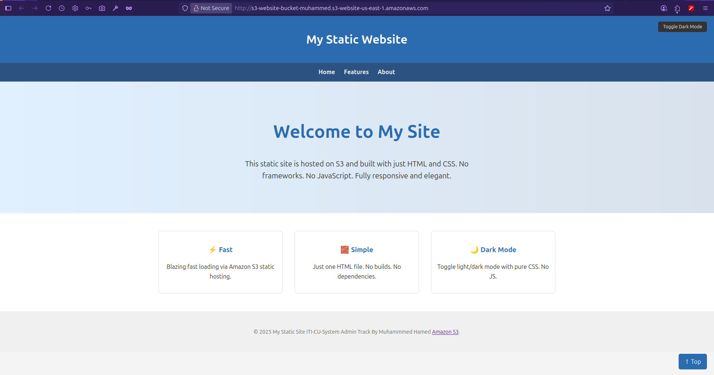

# 🚀 AWS S3 Static Website with Terraform




This project provisions an S3 bucket to host a static website using Terraform. 

## 📁 Files
- `main.tf` – Terraform resources
- `provider.tf` – AWS provider setup
- `variables.tf` –  variables where you can customize 
- `terraform.tfvars` – Variable values (e.g., path to `index.html`)
- `policy.json` – S3 bucket policy for public read
- `output.tf` – Outputs the website endpoint 
- `index.html` – Your homepage

## 🔧 Prerequisites
- **Terraform**: [Install Terraform](https://www.terraform.io/downloads)
- **AWS CLI**: [Install AWS CLI](https://docs.aws.amazon.com/cli/latest/userguide/getting-started-install.html)
- **AWS Credentials**: Configure the CLI with:
  ```bash
  aws configure


#### 🚀 Usage

1. **Initialize Backend**
   ```bash
   terraform init

2. **Terraform plan**
   ```bash
   terraform plan   


3. **Terraform apply**
   ```bash
   terraform apply 

